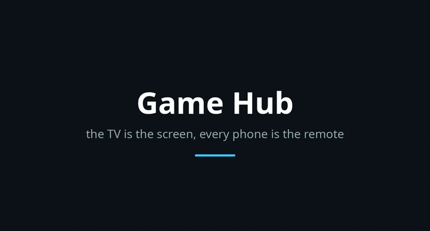

# Game Hub

A living-room game console made out of a television, a laptop and whatever
phones are in the room. It looks like a Wii, because that is the last console
that got the important thing right: the hard part is not the games, it is the
thirty seconds before the games.



*Two phones on the shelf, then in a game. Both of them are
websocket clients speaking the handset protocol -- the server
cannot tell, which is the whole point of keeping the pointer on
the server side.*

Open the hub on the TV and it shows a QR code. Anyone points a phone camera at
it, taps through the certificate warning once, and their phone is a controller
— tilt to move a cursor on the television, A and B under the thumb, a d-pad,
and a motor that buzzes when something on screen hits them. Up to four at once,
each with their own colour, their own name and their own cursor. No app store,
no pairing, no install. A phone that reconnects gets its old slot back.

## How it works

The phone streams its orientation as quaternions, sixty times a second, over a
token-gated HTTPS socket. **Everything else happens in Python.** The sensor
fusion, the recentring, the mapping from an angle to a point on the screen, and
the flick detector all live on the server, which means the entire feel of the
pointer is testable with pytest and none of it depends on a browser.

```
phone (quaternions) ── wss ──> server (fusion, aim, flicks) ── postMessage ──> game
```

A game is a folder with a `game.json` and an `index.html`. It never learns that
a phone exists. It receives a pointer in 0..1 coordinates, button events, flicks
and gestures, and it can ask a specific player's phone to buzz. That is the
whole contract, and it is in `web/shared/gamehub-api.js`.

## The games

| Game | Players | What it is |
|---|---|---|
| **Snake** | 1 | Steer with a wrist flick. A flick is a *rate*, so holding the phone tilted does nothing. |
| **Road Hop** | 1 | Lanes, a river, a level crossing, and an eagle if you fall behind. Axonometric voxels in canvas 2D. |
| **Colour Sort** | 1 | Pour liquid between tubes. Boards are dealt by undoing legal pours from solved, so solvability is a property of construction. |
| **Balloon Rush** | 1–4 | Everyone pops at once, combos, and a bomb that costs you three. |
| **Hot Potato** | 2–4 | The bomb buzzes in *your* hand and only you know how close it is. Point at somebody and press A. |

`docs/plans/` has the designs for the next twenty.

## Controls

The remote adapts. A game declares what it uses in `game.json`, and controls it
ignores are removed from the phone rather than greyed out — and when what is
left is A alone, the button stops being a circle and becomes the whole screen,
so there is nothing to miss.

Flick sensitivity is not a guess: open the gear on the phone, press Calibrate,
snap your wrist five times, and the threshold is set from what your hand
actually does.

## Running it

```sh
python -m gamehub          # then open the URL it prints on the TV
./install.sh               # adds a desktop entry
```

Python 3.11+, `aiohttp`, `cryptography`, `pillow`, `qrcode`. Node and Chromium
are optional and only used by the tests. The server generates its own
self-signed certificate for whichever LAN address faces the television —
phones need HTTPS before a browser will hand out motion sensors at all, which
is the single most annoying fact about this entire project.

Nothing is written outside `~/.local/share/gamehub/` and
`~/.local/state/gamehub/`.

## Tests

```sh
python -m pytest
```

150 of them. The game rules run headless in node against a canvas-free
`world.js`; every page is opened in headless Chromium and the check fails on
any console error, because a game whose script throws while parsing paints
nothing and nothing looks exactly like a deliberately empty screen.

A handful skip without recorded phone traces — the constants that decide how
this feels are guesses until a real hand has moved a real phone, so the phone
can record itself and the recording replays in pytest.

## Licence

MIT. All artwork is drawn in-repo, in code.
